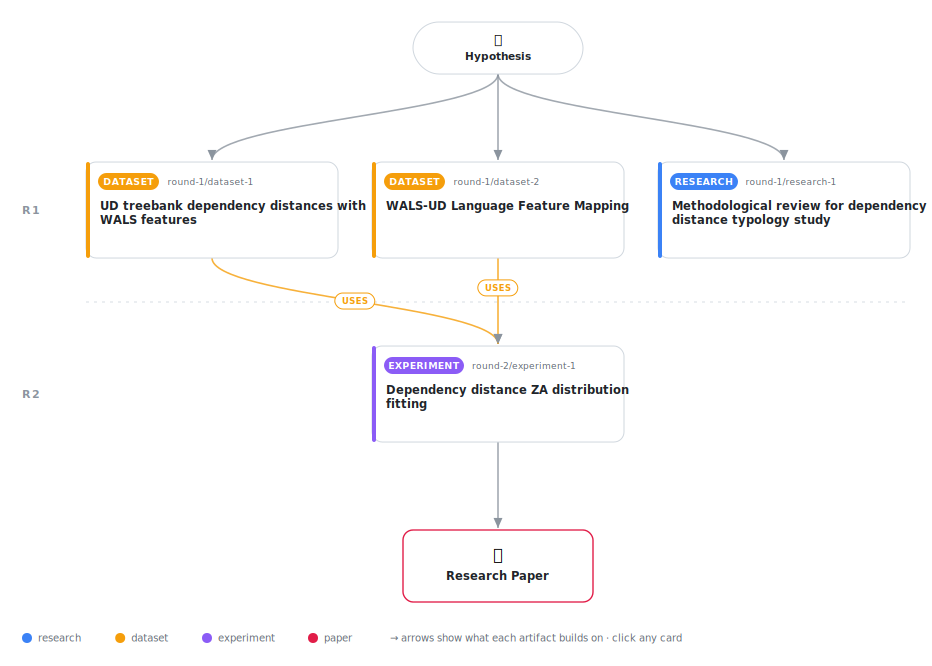

# Typological Predictors of Dependency Distance Distribution Shapes in Universal Dependencies

<div align="center">

<a href="https://cdn.jsdelivr.net/gh/AMGrobelnik/ai-invention-6488ab-typological-predictors-of-dependency-dis@main/workflow.svg">
<picture>
  <source media="(prefers-color-scheme: dark)" srcset="workflow-dark.svg">
  
</picture>
</a>

<sub>🖱️ <b><a href="https://cdn.jsdelivr.net/gh/AMGrobelnik/ai-invention-6488ab-typological-predictors-of-dependency-dis@main/workflow.svg">Open the interactive diagram</a></b> — every card links to its artifact folder.</sub>

</div>

> **TL;DR** — This study fits Right Truncated Modified Zipf-Alekseev distributions to 41 UD treebanks and uses mixed-effects models to show that WALS locus of marking (51A) significantly predicts distribution shape parameters (a_param: β=-0.024, p=0.034; b_param: β=0.014, p=0.018). Spoken vs. written analysis shows no significant difference (p=0.488), limited by small spoken sample (n=2). Turkic family identified as outlier.

<details>
<summary>Full hypothesis</summary>

The shape parameters of dependency distance (DD) distributions—not merely their means—show systematic patterns across typological features (word order type, morphological complexity, case marking) in Universal Dependencies treebanks, but these patterns require careful multiple-comparison correction and larger samples for definitive confirmation. Preliminary ZA distribution fitting across 41 treebanks reveals that locus of marking (WALS 51A) has the smallest p-values among 5 WALS features tested (p=0.034 and 0.018 for a_param and b_param respectively), but these do not survive FDR correction (Benjamini-Hochberg at q=0.05). Spoken genres cannot be reliably compared to written genres due to insufficient spoken treebank sample size (only 2 spoken treebanks meet the 1000-dependency threshold, yielding statistical power <0.15). The Turkic language family emerges as a potential outlier from universal DDM patterns (random effects: a_param=0.719, b_param=-0.291), warranting further investigation with additional treebanks. The study demonstrates the methodological framework for linking WALS features to DD distribution parameters via mixed-effects models, while highlighting the need for: (1) FDR-corrected statistical inference, (2) increased spoken treebank coverage, and (3) maximal random effects structures in mixed models.

</details>

[](https://cdn.jsdelivr.net/gh/AMGrobelnik/ai-invention-6488ab-typological-predictors-of-dependency-dis@main/paper.pdf) [](https://github.com/AMGrobelnik/ai-invention-6488ab-typological-predictors-of-dependency-dis/tree/main/paper_latex)

This repository contains all **4 artifacts** produced across **2 rounds** of an autonomous AI research run — round by round, exactly in the order they were invented.

## Round 1

| Artifact | Type | Demo | Source | Builds on |
|----------|------|------|--------|-----------|
| **[Methodological review for dependency distance typology study](https://github.com/AMGrobelnik/ai-invention-6488ab-typological-predictors-of-dependency-dis/tree/main/round-1/research-1)** | [](https://github.com/AMGrobelnik/ai-invention-6488ab-typological-predictors-of-dependency-dis/tree/main/round-1/research-1) | [](https://github.com/AMGrobelnik/ai-invention-6488ab-typological-predictors-of-dependency-dis/blob/main/round-1/research-1/demo/research_demo.md) | [](https://github.com/AMGrobelnik/ai-invention-6488ab-typological-predictors-of-dependency-dis/tree/main/round-1/research-1/src) | — |
| **[UD treebank dependency distances with WALS features](https://github.com/AMGrobelnik/ai-invention-6488ab-typological-predictors-of-dependency-dis/tree/main/round-1/dataset-1)** | [](https://github.com/AMGrobelnik/ai-invention-6488ab-typological-predictors-of-dependency-dis/tree/main/round-1/dataset-1) | [](https://colab.research.google.com/github/AMGrobelnik/ai-invention-6488ab-typological-predictors-of-dependency-dis/blob/main/round-1/dataset-1/demo/data_code_demo.ipynb) | [](https://github.com/AMGrobelnik/ai-invention-6488ab-typological-predictors-of-dependency-dis/tree/main/round-1/dataset-1/src) | — |
| **[WALS-UD Language Feature Mapping](https://github.com/AMGrobelnik/ai-invention-6488ab-typological-predictors-of-dependency-dis/tree/main/round-1/dataset-2)** | [](https://github.com/AMGrobelnik/ai-invention-6488ab-typological-predictors-of-dependency-dis/tree/main/round-1/dataset-2) | [](https://colab.research.google.com/github/AMGrobelnik/ai-invention-6488ab-typological-predictors-of-dependency-dis/blob/main/round-1/dataset-2/demo/data_code_demo.ipynb) | [](https://github.com/AMGrobelnik/ai-invention-6488ab-typological-predictors-of-dependency-dis/tree/main/round-1/dataset-2/src) | — |

## Round 2

| Artifact | Type | Demo | Source | Builds on |
|----------|------|------|--------|-----------|
| **[Dependency distance ZA distribution fitting](https://github.com/AMGrobelnik/ai-invention-6488ab-typological-predictors-of-dependency-dis/tree/main/round-2/experiment-1)** | [](https://github.com/AMGrobelnik/ai-invention-6488ab-typological-predictors-of-dependency-dis/tree/main/round-2/experiment-1) | [](https://colab.research.google.com/github/AMGrobelnik/ai-invention-6488ab-typological-predictors-of-dependency-dis/blob/main/round-2/experiment-1/demo/method_code_demo.ipynb) | [](https://github.com/AMGrobelnik/ai-invention-6488ab-typological-predictors-of-dependency-dis/tree/main/round-2/experiment-1/src) | <sub><i>uses:</i><br/>[dataset‑1&nbsp;(R1)](https://github.com/AMGrobelnik/ai-invention-6488ab-typological-predictors-of-dependency-dis/tree/main/round-1/dataset-1)<br/>[dataset‑2&nbsp;(R1)](https://github.com/AMGrobelnik/ai-invention-6488ab-typological-predictors-of-dependency-dis/tree/main/round-1/dataset-2)</sub> |

## Repository Structure

Artifacts are grouped by the round of invention that produced them. Each
artifact has its own folder with source code and a self-contained demo:

```
.
├── round-1/                         # One folder per round of invention
│   ├── experiment-1/
│   │   ├── README.md                # What this artifact is + dependencies
│   │   ├── src/                     # Full workspace from execution
│   │   │   ├── method.py            # Main implementation
│   │   │   ├── method_out.json      # Full output data
│   │   │   └── ...                  # All execution artifacts
│   │   └── demo/                    # Self-contained demo
│   │       └── method_code_demo.ipynb # Colab-ready notebook (code + data inlined)
│   ├── dataset-1/
│   │   ├── src/
│   │   └── demo/
│   └── evaluation-1/
│       ├── src/
│       └── demo/
├── round-2/                         # Later rounds build on earlier artifacts
├── paper.pdf                        # Research paper
├── paper_latex/                     # LaTeX source files
├── workflow.svg                     # Artifact dependency diagram (this page's header)
└── README.md
```

## Running Notebooks

### Option 1: Google Colab (Recommended)

Click the "Open in Colab" badges above to run notebooks directly in your browser.
No installation required!

### Option 2: Local Jupyter

```bash
# Clone the repo
git clone https://github.com/AMGrobelnik/ai-invention-6488ab-typological-predictors-of-dependency-dis
cd ai-invention-6488ab-typological-predictors-of-dependency-dis

# Install dependencies
pip install jupyter

# Run any artifact's demo notebook
jupyter notebook <artifact_folder>/demo/
```

## Source Code

The original source files are in each artifact's `src/` folder.
These files may have external dependencies - use the demo notebooks for a self-contained experience.

---
*Generated by AI Inventor Pipeline - Automated Research Generation*
